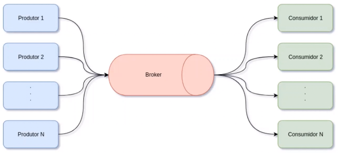
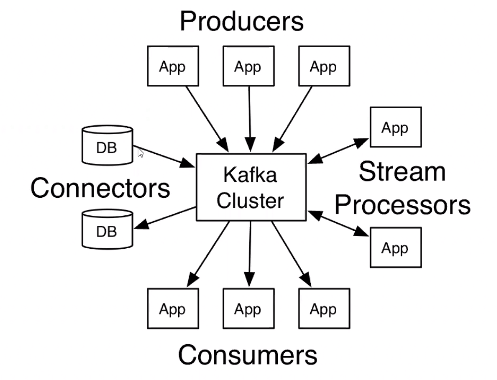
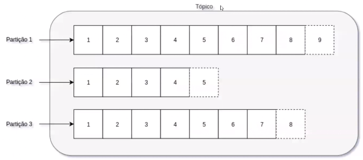
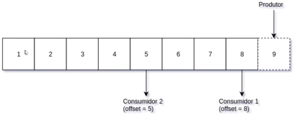
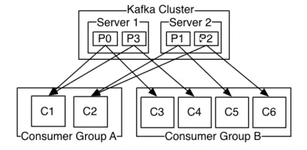
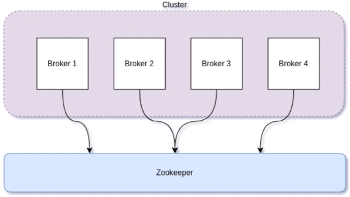
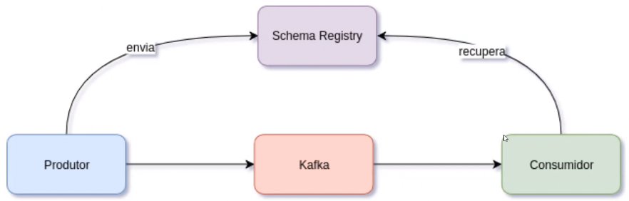
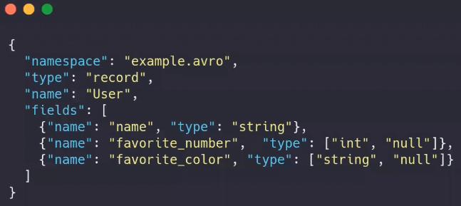

# Apache Kafka

### Arquitetura (Streaming data)

### Vantagens (Streaming data)

* Coletar, processar e armazenar um grande volume de dados em tempo real

* Alta disponibilidade de dados

* Confiabilidade

### Definição

* Apache Kafka é uma plataforma distribuída de mensagens e streaming

  > Diferentemente do RabbitMQ, por exemplo, que é apenas um serviço de mensageria

### Fluxo de dados Apache Kafka

### Conceitos sobre Apache Kafka

* **Mensagem**: são informações produzidas pelo(s) produtor(es)

* **Tópico**: identificar (categoria / nome do feed) de uma mensagem no qual será utilizado pelo consumidor e produtor

* **Produtor**: responsável pela produção de mensagens

* **Consumidor**: responsável pelo consumo de mensagens

* **Broker**: nome dados a cada instância do Apache Kafka

* **Cluster**: conjunto de Brokers

* **Apache Zookeeper**: gerenciador das várias instâncias do Apache Kafka (Brokers)

* **Schema Registry**: estrutura de uma mensagem, afim de garantir a padronização das mensagens

* **Representações**

  

    * Um tópico pode possuir várias partições

    * Não é possível gerenciar em qual partição uma mensagem será enviada

  

    * Cada "quadrado" é chamado de ***offset*** (é como um índice em um lista)

    * Cada nova mensagem, produzido pelo Produtor, é adicionada no final da "fila" (assim como na estrutura de dado Queue, em Java, ou seja, "o último a entrar e o último a sair")

  

    * As partições serão distribuída da melhor forma, afim de garantir uma alta disponibilidade/escalabilidade

  

    * Responsável por definir o **master** e os **slaves**

  

    * O produtor envia a estrutura da mensagem e então, caso a mensagem for válida, o mesmo envia essa mensagem para o broker (Kafka)

    * O consumidor recupera a estrutura da mensagem do Schema Registry e assim recupera a mensagem do broker (Kafka)

### Apache Avro

* **Definição**

  * Fornece uma rica estrutura de dados

  * Oferece um formato de dados binário, compacto, e rápido

  * É um container para gravar dados persistentes

* **Exemplo**

  