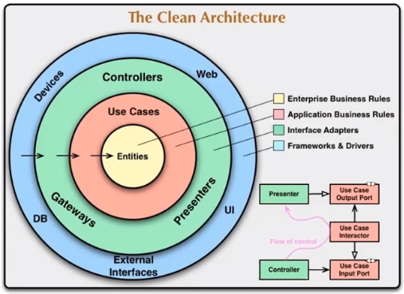

# Agenda - Clean Architecture

### Clean Architecture

* **Principal objetivo**: fornecer aos desenvolvedores um maneira de organizar o código de forma dque encapsule a lógica de negócio, mas  o mantendo separado do mecanismo de entrega

* **Vantagens**

  * Independência de interfaces de usuário

  * Independência da stack tecnológica utilizada para acesso aos dados e/ou expor entradas

  * Altamente testável

  * Carga cognitiva de entendimento do projeto, regras de negócio

  * Fácil manutenção

* **Representação**

  

* **Implementação da Clean Architecture com "Ports and Adapters"**

  