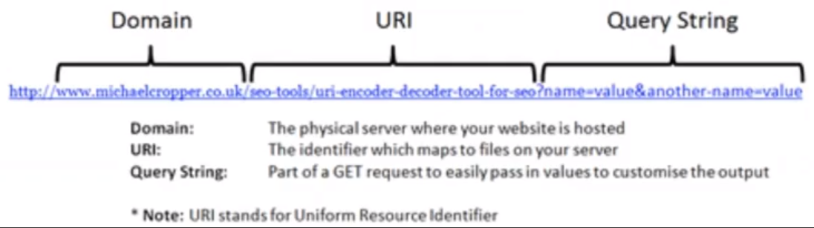

# Sobre Resource Naming Guide e Caching

### Resource naming guide

* Estratégia para expor recursos (palavras no plural ou singular)

* Estrutura de nomes para

  * Recuperar recursos

  * Armazenar detalhes

  * Nomes compostos

  * Parâmetros (*query param*, *path param*)

* **URI**

  * Endereçamento para um determinado recurso

  * **Exemplo**

    

### Caching

* Capacidade de manter cópias de uma resposta (*response*) armazenadas por um tempo determinado

* **Elementos de um token de cache**

  * Tempo de expiração

  * Cache-control

  * E-tag

  * Last modified

* **Cuidados**

  * Possibilidade de utilizar dados desatualizados