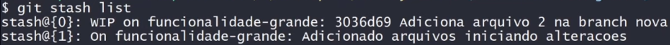

# Comando stash e seus subcomandos

### Comandos

* **Listagem doas branches do repositório atual (de trabalho)**: `$ git branch`

* **Alterar o nome da branch em uso**

  * **Sintaxe**: `$ git branch -m <novo nome da branch>`

  * **Exemplo**: `$ git branch -m funcionalidade`

* **Alterar o nome de uma branch a partir da *branch* principal**

  * **Sintaxe**: `$ git branch -m <branch a ser renomeada> <novo nome da branch>`

  * **Exemplo**: `$ git branch -m funcionalidade nova-funcionalidade`

* **Excluir uma branch**

  * **Sintaxe**: `$ git branch -d <nome da branch>`

  * **Exemplo**: `$ git branch -d nova-funcionalidade`

* **stash**

  * É como um "caixa" para salvar alterações sem afetar nenhuma *branch*

  * Salvar todas as alterações do **index** (*stage area*) e o diretório de trabalho (arquivos *untracked*) no stash

    * **Sintaxe**: 

      * `$ git stash`

      * `$ git stash save <contexto>`

        > É importante informar um contexto, afim de lembrar, futuramente, a função daquele *stash* 

    * **Exemplo**: `$ git stash save "Adicionado arquivos iniciando alterações"`

  * Listagem dos stash
  
    * **Sintaxe**: `$ git stash list`

    * **Exemplo**

      

      > `stash@{0}`, o número entre chaves (`{}`) representa o index de cada *stash*

  * Recuperar as alterações salvas no stash para a branch corrente

    * **Sintaxe**: `$ git stash pop <index>`

    * **Exemplo**: `$ git stash pop 1`

  * Limpar o stash: `$ git stash clear`