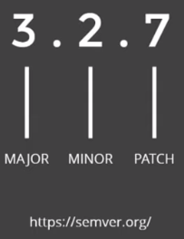

# Conceitos avançados sobre commits

### Versionamento semântico (*semantic versioning*)

* **Alteração *Major***: implementação de uma funcionalidade que quebra a compatibilidade

* **Alteração *Minor***: implementação de uma funcionalidade, mas que ainda mantêm a compatibilidade

* **Alteração *Patch***: correções de bugs ou pequenas alterações

* **Documentação sobre versionamento semântico**: [semver](https://semver.org/lang/pt-BR/)

### Commit semântico (*conventional commits*)

* A especificação do *Conventional Commits* é uma convenção simples para utilizar nas mensagens de *commits*

* Definir uma conjunto de regras para criar um histórico de commit explícitos, afim de facilitar a criação de ferramentas automatizadas baseadas na especificação

* Esta convenção se encaixa com o SemVer (versionamento semântico), descrevendo os recursos, correções e modificações que quebram a compatibilidade nas mensagens de commit

* **Documentação sobre commit semântico**: [conventionalcommits](https://www.conventionalcommits.org/en/v1.0.0/)