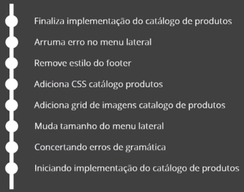
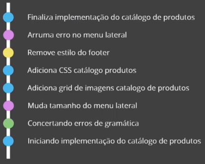
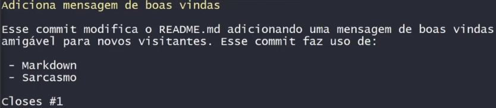

# Conceitos iniciais sobre estruturação de commits

### Vantagens da padronização de commits

* Melhor legibilidade do histórico

* Amigável a novos desenvolvedores

* Amigável ao versionamento semântico

### Commit atómico

* **Sem commits atómicos**

  

  * Dificulta o entendimento de cada modificação 

* **Com commits atómicos**

  

  * **Legenda**

    * **Bola azul**: commit relacionado a implementação de uma nova funcionalidade ou parte dela

    * **Bola roxo**: commit relacionado ao "menu lateral"

    * **Bola verde**: commit relacionado a pequenos ajustes

    * **Bola amarela**: commit relacionado ao "footer"

### Português VS Inglês

* A utilização do português ou inglês para mensagens de commit, depende do contexto do projeto

### Estrutura de um *commit*

* **Assunto**

  * Curto e compreensível

  * Até 50 caracteres

  * Começar com letra maiúscula

  * Não terminar em ponto

  * **Escrito de forma imperativa** (+ importante)

    * Em inglês (*imperative mood*)

      * **Exemplos**

        * "Add a feature" ou "Added a feature"

        * "Modify an existing feature" ou "Modified an existing feature"

        * "Remove a feature" ou "Removed a feature"

      * **"Prova real" do *imperative mood***

        * **"If applied, this commit will ..."**

        * **Exemplos**

          * "If applied, this commit will **add** payment integration"

          * "If applied, this commit will **update** database configurations"

          * "If applied, this commit will **remove** redundant code"
    
    * Em português (voz imperativa)

      * **Exemplo**

        * "Adiciona a funcionalidade *X*" ou "Funcionalidade *X* adicionada"

        * "Modifica uma funcionalidade existente" ou "Funcionalidade *Y* modificada"

        * "Remove a funcionalidade" ou "Funcionalidade *Y* removida"

      * **"Prova Real" da voz imperativa**

        * "Se aceito, esse commit **adiciona** métodos de pagamento"

        * "Se aceito, esse commit **atualiza** configurações do banco de dados"

        * "Se aceito, esse commit **remove** código redundante"

* **Corpo**

  * Adicione detalhes ao commit

  * Tente quebrar a linha em 75 caracteres (facilita a visualização no terminal)

  * Identifique sua audiência

  * Explique de forma explícita (não assumir que o leitor tenha um conhecimento prévio ou pensar que o código é autoexplicativo)

  * Utilize markdown (arquivo `.md`)

* **Rodapé**

  * É opcional

  * Referencie assuntos relacionados

    * *Issues* do GitHub

* **Exemplo**

  

  * "Closes #1" é a referência para uma *issue do GitHub* que foi resolvido (*closed*)

    > Sintaxe para relacionar uma Issue ao Commit: `Closes #ID da issue>`