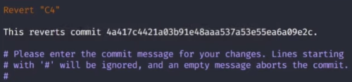

# Conceitos iniciais sobre reverter commits

### Introdução

* Não é recomendado reverter commits muito antigos

### git reset

* **Reverter um commit a partir do seu hash**

  * **Sintaxe**: `$ git reset <hash>`

  * **Exemplo**: `$ git reset 8fs7lxc1`

* **Reverter um commit a partir da tag HEAD**

  * **Sintaxe**: `$ git reset <tag HEAD>`

  * **Exemplo**: `$ git reset HEAD~1`

    > `HEAD~1` = commit anterior a tag HEAD

    > `HEAD~2` = 2 commits antes da tag HEAD

* **Flags**

  * `--soft`

    * **Função**: mover um commit para o index (*staging area*)

    * **Sintaxe**
      
      * `$ git reset --soft`

        > Ao não especificar um commit, o Git entenderá como HEAD~1 (commit anterior a tag HEAD)

      * `$ git reset --soft HEAD~1`

    * **Exemplo**: `$ git reset --soft HEAD~1`

  * `--mixed`

    * **Função**: mover um commit para a área de trabalho (*working directory*)

    * **Sintaxe**
      
      * `$ git reset --mixed`

        > Ao não especificar um commit, o Git entenderá como HEAD~1 (commit anterior a tag HEAD)

      * `$ git reset --mixed HEAD~1`
    
    * **Exemplo**: `$ git reset --mixed HEAD~1`

  * `--hard`

    * **CUIDADO**: é necessário tomar cuidado ao utilizar a flag `--hard`, pois ao executar o comando (`git reset`) com essa flag, os arquivos serão **EXCLUÍDOS**

    * **Função**: **EXCLUIR** um commit (commit **não** é movido para *index* e nem para o *working directory*)

    * **Sintaxe**

      * `$ git reset --hard`

        > Ao não especificar um commit, o Git entenderá como HEAD~1 (commit anterior a tag HEAD)

      * `$ git reset --hard HEAD~1`

    * **Exemplo**: `$ git reset --hard HEAD~1` 

### git revert

* **Conceitos**

  * Não tem flags pois esse comando não manipula os arquivos, mas sim os *commits*

  * É gerado um novo *commit* com as alterações revertidas de um determinado *commit*

  * Esse comando executa a ação inversa do commit a ser revertido

    * arquivo untracked -> arquivo no staging area (`git commit ...`)

    * arquivo no staging area -> arquivo untracked (arquivo excluído) (`git revert ...`)

* **Reverter um commit a partir do seu hash**

  * **Sintaxe**: `$ git revert <hash>`

  * **Exemplo**: `$ git revert 8fs7lxc1`

* **Reverter um commit a partir da tag HEAD**

  * **Sintaxe**: `$ git revert <tag HEAD>`

  * **Exemplo**: `$ git revert HEAD~1`

    * **Saída**

      

      * `Revert "C4"` = mensagem do commit

      * `This reverts commit 4a41...` = descrição do commit